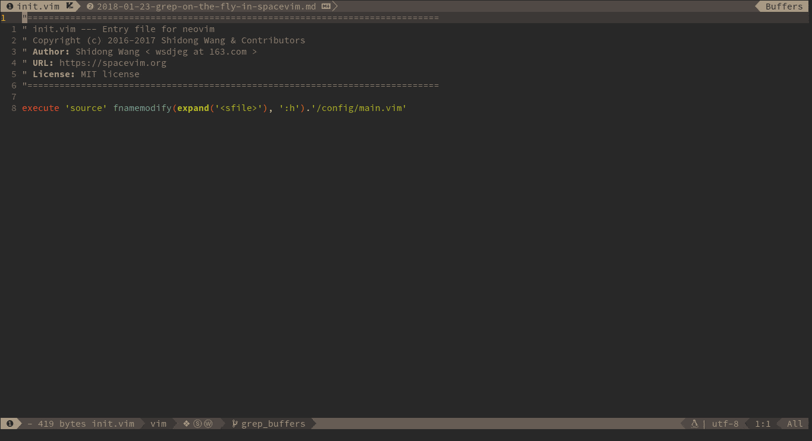

title: How to Install SpaceVim Without Messing Up Your Neovim Installation
slug: how-to-install-spacevim-without-messing-up-your-neovim-installation
lang: en
date: Sun Aug 22 06:30:23 PM -03 2021
modified: Sun Aug 22 07:44:18 PM -03 2021
tags: tricks, vim, neovim, spacevim, gnu/linux
summary: 
status: published



Want to install [SpaceVim](https://github.com/SpaceVim/SpaceVim) without
messing up with your vim/neovim installation? Here is the recipe:

## Clone the SpaceVim repository:

``` {.bash .hljs}
git clone https://github.com/SpaceVim/SpaceVim.git ~/.SpaceVim
```

## Set Up Options When Launching vim/nvim/neovide

### Neovim:

``` {.bash .hljs}
XDG_CONFIG_HOME=~/.SpaceVim nvim -u ~/.SpaceVim/vimrc
```

### Vim:

``` {.bash .hljs}
XDG_CONFIG_HOME=~/.SpaceVim vim -u ~/.SpaceVim/vimrc
```

### Neovide:

``` {.bash .hljs}
XDG_CONFIG_HOME=~/.SpaceVim neovide -u ~/.SpaceVim/vimrc
```

## Set Up an Alias to Launch It as a Command:

Put in you `.bashrc`, or `.zshrc` etc:

``` {.bash .hljs}
alias spacevim='XDG_CONFIG_HOME=~/.SpaceVim nvim -u ~/.SpaceVim/vimrc'
```

Restart the shell and use `spacevim` to open it.
